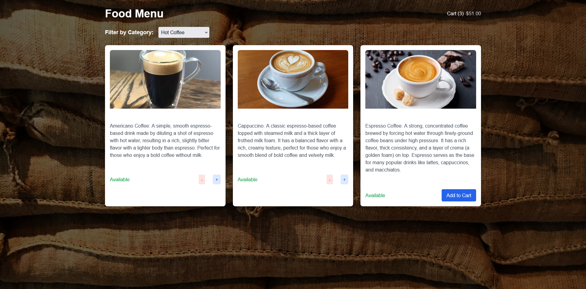
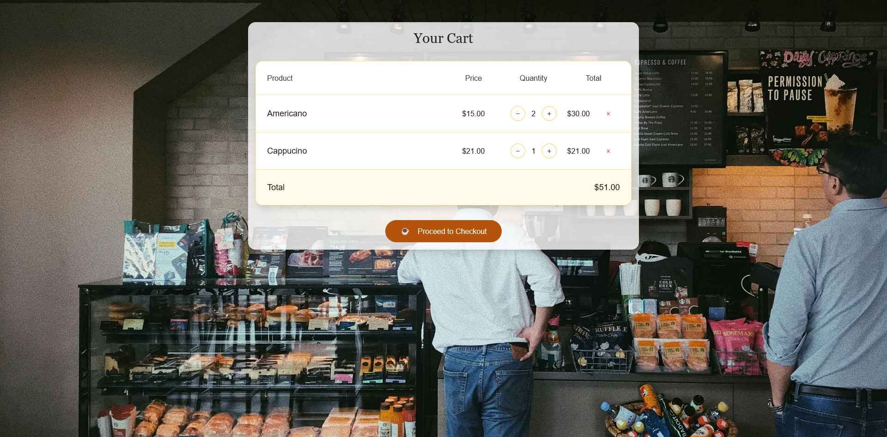
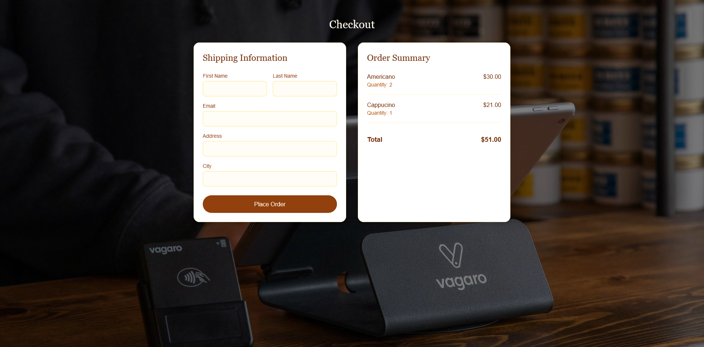

It is  a minimal full-stack web application, combining the robust backend capabilities of Django with the dynamic and interactive frontend features of Next.js. This project provides users with an intuitive platform to explore a variety of coffee products, manage their cart, and complete their orders seamlessly. It is supposed to be an easy starter for projects.
Features

    User-Friendly Interface: Built with Next.js, the application offers a modern, responsive design that enhances the user experience across devices.

    Dynamic Menu: The menu is fetched from a Django REST API, allowing users to browse, filter, and explore various coffee products and categories easily.
    
    The administrative features include the ability for users to add or remove products, manage categories, and track orders.
    
    Shopping Cart Functionality: Users can effortlessly add items to their cart, view their selections, and manage quantities before proceeding to checkout.

    Secure Checkout Process: Integrated order form for users to input their personal information, review their order details, and confirm purchases securely. The application handles order submissions and confirmations smoothly.

    Real-Time Updates: Leveraging React's state management, the interface updates in real time as users interact with the app, providing a seamless browsing and shopping experience.

Technologies Used

    Backend: Django, Django REST Framework for building the API.
    Frontend: Next.js, React for creating a dynamic user interface.
    Styling: Tailwind CSS for a modern and responsive design.
    State Management: Context API for managing cart state.
    Database: SQLlite for storing product and order data, using Django's ORM for database interactions.

# Project Screenshots

[Watch the Video Preview](https://youtu.be/BF_NGxqkAS8)

